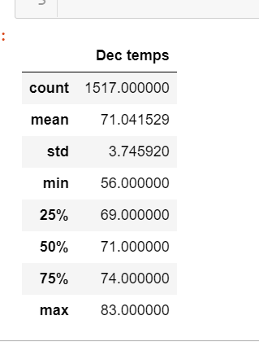

# surfs_up

# Overview of the statistical analysis

I have done throurough work to analyse the hawaii cliamte data. I have used SQLAlchemy, and a Flask API, climate_app.py to pull data from the hawaii.sqlite weather station tables. 

I used python and notebook for data analysis. Now, the work which is require is to pull temperature data for the months of June and December in Oahu, in order to determine if the surf and ice cream shop business is sustainable year-round.

# Results:

I have pulled june data from 2010 up to 2018. The total data for June was 18,239 presented in a list.
## June
The temperatured pulled are as below in a dataframe.
- June temperature

The mean is 73.2 and the max is 87 with 75% of the data located in the 76 which is better for vacations.

I also plot the data to have an idea of temperature fluctuation.

- June plot

## December 
The december data do not differ match with june. See below the dataframe summarizing the results.
- December dataframe

17,001 count with a mean of 73.1 and a max of 87, which is similar to June.
- Plot December

The plot also look similar and no mjor difference with temperature favorable to a summer business.

# Summary

As captured above, the temperature for Juen and December do not differ much and look similar. With the same statistical outcome, it's considered as better for the summer business. I encouraged Avy in the business.

The outcome of the data analysis is that the surf and ice cream shop business are sustainable year-round.